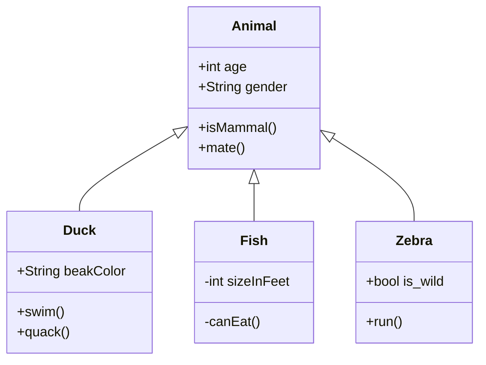
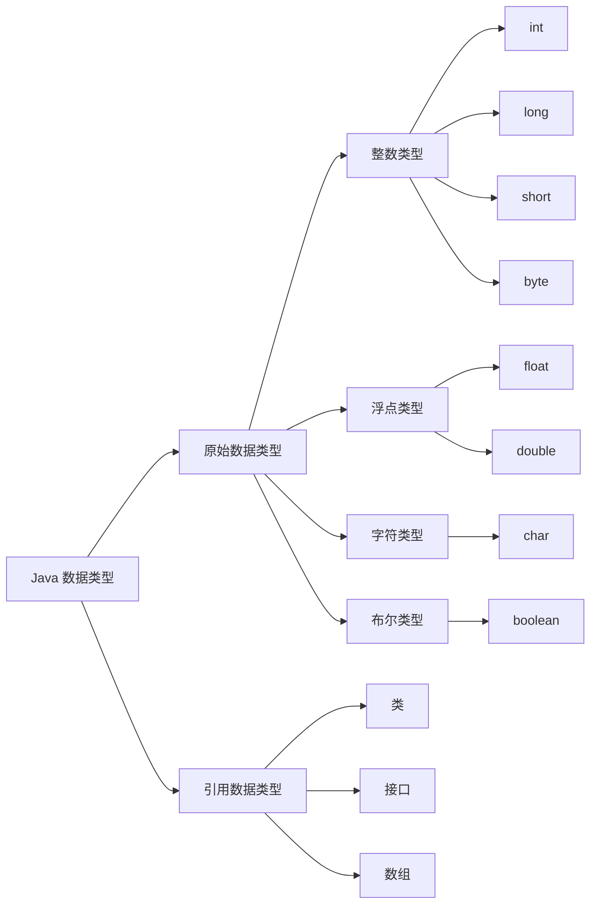
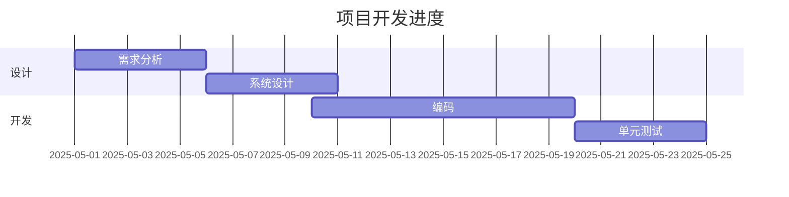

# **markdown**

## 快捷键

|   功能   |  快捷键  |
| :------: | :------: |
|   加粗   | Ctrl + B |
|   斜体   | Ctrl + I |
|   引用   | Ctrl + Q |
| 插入链接 | Ctrl + L |
| 插入代码 | Ctrl + K |
| 插入图片 | Ctrl + G |
| 提升标题 | Ctrl + H |
| 有序列表 | Ctrl + O |
| 无序列表 | Ctrl + U |
|   横线   | Ctrl + R |
|   撤销   | Ctrl + Z |
|   重做   | Ctrl + Y |

## 美化字符

## 基本语法

### 字体

- 斜体  
  _这里是文字_  
  `*这里是文字*`  
  _这里是文字_  
  `_这里是文字_`
- 加粗  
  **这里是文字**  
  `**这里是文字**`
- 删除线  
  ~~这里是文字~~  
  `~~这里是文字~~`
- 粗斜  
  **_这里是文字_**  
  `***这里是文字***`

### 图片、链接

``

``

`[链接描述](链接地址)`

### 分割线

---

`***`

---

`---`

---

`___`

### 表格

<table>
    <tr>
        <th rowspan="2">值日人员</th>
        <th>周一</th>
        <th>周二</th>
        <th>周三</th>
    </tr>
    <tr>
        <td>张三</td>
        <td>李四</td>
        <td>王五</td>
    </tr>
</table>

```
  <table>
      <tr>
          <th rowspan="2">值日人员</th>
          <th>周一</th>
          <th>周二</th>
          <th>周三</th>
      </tr>
      <tr>
          <td>张三</td>
          <td>李四</td>
          <td>王五</td>
      </tr>
  </table>

```

|   功能   |  快捷键  |
| :------: | :------: |
|   加粗   | Ctrl + B |
|   斜体   | Ctrl + I |
|   引用   | Ctrl + Q |
| 插入链接 | Ctrl + L |
| 插入代码 | Ctrl + K |
| 插入图片 | Ctrl + G |
| 提升标题 | Ctrl + H |
| 有序列表 | Ctrl + O |
| 无序列表 | Ctrl + U |
|   横线   | Ctrl + R |
|   撤销   | Ctrl + Z |
|   重做   | Ctrl + Y |

```
功能|快捷键
:-:|:-:
加粗|Ctrl + B
斜体|Ctrl + I
引用|Ctrl + Q
插入链接|Ctrl + L
插入代码|Ctrl + K
插入图片|Ctrl + G
提升标题|Ctrl + H
有序列表|Ctrl + O
无序列表|Ctrl + U
横线|Ctrl + R
撤销|Ctrl + Z
重做|Ctrl + Y
```

### 引用

> 文字  
> 文字  
> 文字

```
> 文字
> 文字
> 文字
```

- 分级引用
  > > > 文字  
  > > > 啊  
  > > > 这

```
  >>> 文字
  >> 啊
  > 这
```

> [!NOTE] 重要
> 强调用户在快速浏览文档时也不应忽略的重要信息。

> [!TIP]
> 有助于用户更顺利达成目标的建议性信息。

> [!IMPORTANT]
> 对用户达成目标至关重要的信息。

> [!WARNING]
> 因为可能存在风险，所以需要用户立即关注的关键内容。

> [!CAUTION]
> 行为可能带来的负面影响。

```
  > [!NOTE] 重要
  > 强调用户在快速浏览文档时也不应忽略的重要信息。

  > [!TIP]
  > 有助于用户更顺利达成目标的建议性信息。

  > [!IMPORTANT]
  > 对用户达成目标至关重要的信息。

  > [!WARNING]
  > 因为可能存在风险，所以需要用户立即关注的关键内容。

  > [!CAUTION]
  > 行为可能带来的负面影响。
```

### 代码

`代码高亮`配合`聚焦代码`

在某一行后添加 // [!code focus] 注释会聚焦该行，并模糊代码的其他部分
在某一行上添加 // [!code --] 或 // [!code ++] 注释将创建该行的差异，同时保留代码块的颜色
在某一行上添加 // [!code warning] 或 // [!code error] 注释会相应地为其着色

```ts{1,3-4}
export default defineConfig({
  lang: 'zh-CN',
  title: "VitePress",
  description: "我的vitpress文档教程", // [!code focus]
  titleTemplate: '另起标题覆盖title' ,
})
```

````md
```ts{1,3-4}
export default defineConfig({
  lang: 'zh-CN',
  title: "VitePress",
  description: "我的vitpress文档教程", // [!!code focus]
  titleTemplate: '另起标题覆盖title' ,
})

```
````

如果你在某个代码块不想使用，可以通过 ts:no-line-numbers 来临时关闭

```ts:no-line-numbers
无行号演示
```

````
```ts:no-line-numbers
无行号演示

```
````

代码组

::: code-group

```sh [pnpm]
#查询pnpm版本
pnpm -v
```

```sh [yarn]
#查询yarn版本
yarn -v
```

:::

````md
::: code-group

```sh [pnpm]
#查询pnpm版本
pnpm -v
```

```sh [yarn]
#查询yarn版本
yarn -v
```

:::
````

### 折叠

<details>
  <summary>点我展开</summary>
  Markdown默认折叠语法，Vitepress可以使用容器折叠语法，更加美观
</details>

```md
<details>
  <summary>点我展开</summary>
  Markdown默认折叠语法，Vitepress可以使用容器折叠语法，更加美观
</details>
```

::: details 点我展开
Vitepress 可以使用容器折叠语法，更加美观

Vitepress 可以使用容器折叠语法，更加美观

- 区别：Vitepress 可以使用容器折叠语法，更加美观
  :::

```md
::: details 点我展开
Vitepress 可以使用容器折叠语法，更加美观

Vitepress 可以使用容器折叠语法，更加美观

- 区别：Vitepress 可以使用容器折叠语法，更加美观
  :::
```

### Badge 组件

- VitePress <Badge type="info" text="default" />
- VitePress <Badge type="tip" text="^1.9.0" />
- VitePress <Badge type="warning" text="beta" />
- VitePress <Badge type="danger" text="caution" />

```md
- VitePress <Badge type="info" text="default" />
- VitePress <Badge type="tip" text="^1.9.0" />
- VitePress <Badge type="warning" text="beta" />
- VitePress <Badge type="danger" text="caution" />
```

### 注脚

` 添加注脚的文字后加上脚注名字[^1]`

`[^1]:注脚1跳转位置`

_vitepress 无法直接显示，插件需要_

### 流程图

- [ ] 吃饭
- [ ] 睡觉
- [x] 打豆豆

```
- [ ] 吃饭
- [ ] 睡觉
- [x] 打豆豆
```

- 流程图

  ```mermaid
    flowchart TD
    A[Christmas] -->|Get money| B(Go shopping)
    B --> C{Let me think}
    C -->|One| D[Laptop]
    C -->|Two| E[iPhone]
    C -->|Three| F[fa:fa-car Car]
  ```

  ```mermaid
    graph TD
    A([开始]) -->B(中转)
    B --> C{是或否}
    C -->|是| B
    C -->|否| D([结束])
  ```





````

````


