```mermaid
graph LR
    A[Java 数据类型] --> B[原始数据类型]
    A[Java 数据类型] --> C[引用数据类型]
    
    B --> D[整数类型]
    B --> E[浮点类型]
    B --> F[字符类型]
    B --> G[布尔类型]
    
    D --> H[int]
    D --> I[long]
    D --> J[short]
    D --> K[byte]
    
    E --> L[float]
    E --> M[double]
    
    F --> N[char]
    
    G --> O[boolean]
    
    C --> P[类]
    C --> Q[接口]
    C --> R[数组]
```

# **markdown**

## 快捷键

功能|快捷键
:-:|:-:
加粗|Ctrl + B
斜体|Ctrl + I
引用|Ctrl + Q
插入链接|Ctrl + L
插入代码|Ctrl + K
插入图片|Ctrl + G
提升标题|Ctrl + H
有序列表|Ctrl + O
无序列表|Ctrl + U
横线|Ctrl + R
撤销|Ctrl + Z
重做|Ctrl + Y


## 美化字符  

✅  

✔️  

❌ 

🔚  

📌  

🔷  

🔶  

🔹  

🔸  

🔺  

🔻  

🔵  

🔴  

⚫  

⚪  

🔠 

🔧  

🔠 

🚫  

👨  

⚠️  

💡  

📦  

🗂️  

📋  

🔢  

🥇  

🥈  

🥉  

🔟  

⏱️  

🔥  

📎 

ℹ️  

✳️  

🔒


## 基本语法

### 字体
- 斜体  
  *这里是文字*  
  `*这里是文字*`  
  _这里是文字_  
  `_这里是文字_`
- 加粗  
  **这里是文字**  
  `**这里是文字**`  
- 删除线  
  ~~这里是文字~~  
  `~~这里是文字~~`
- 粗斜  
  ***这里是文字***  
  `***这里是文字***`

### 图片、链接  
``  

``  

`[链接描述](链接地址)`   

### 分割线  

***
`***`   

---   
`---`  

___  
`___`  

### 表格  

<table>
    <tr>
        <th rowspan="2">值日人员</th>
        <th>周一</th>
        <th>周二</th>
        <th>周三</th>
    </tr>
    <tr>
        <td>张三</td>
        <td>李四</td>
        <td>王五</td>
    </tr>
</table>

```
  <table>
      <tr>
          <th rowspan="2">值日人员</th>
          <th>周一</th>
          <th>周二</th>
          <th>周三</th>
      </tr>
      <tr>
          <td>张三</td>
          <td>李四</td>
          <td>王五</td>
      </tr>
  </table>

```
功能|快捷键
:-:|:-:
加粗|Ctrl + B
斜体|Ctrl + I
引用|Ctrl + Q
插入链接|Ctrl + L
插入代码|Ctrl + K
插入图片|Ctrl + G
提升标题|Ctrl + H
有序列表|Ctrl + O
无序列表|Ctrl + U
横线|Ctrl + R
撤销|Ctrl + Z
重做|Ctrl + Y

```
功能|快捷键
:-:|:-:
加粗|Ctrl + B
斜体|Ctrl + I
引用|Ctrl + Q
插入链接|Ctrl + L
插入代码|Ctrl + K
插入图片|Ctrl + G
提升标题|Ctrl + H
有序列表|Ctrl + O
无序列表|Ctrl + U
横线|Ctrl + R
撤销|Ctrl + Z
重做|Ctrl + Y
```

### 引用

> 文字  
> 文字  
> 文字  

```
> 文字
> 文字
> 文字
```
- 分级引用
  >>> 文字  
  >> 啊  
  > 这  

 ```
   >>> 文字  
   >> 啊  
   > 这  
 ```

> [!NOTE] 重要
> 强调用户在快速浏览文档时也不应忽略的重要信息。

> [!TIP]
> 有助于用户更顺利达成目标的建议性信息。

> [!IMPORTANT]
> 对用户达成目标至关重要的信息。

> [!WARNING]
> 因为可能存在风险，所以需要用户立即关注的关键内容。

> [!CAUTION]
> 行为可能带来的负面影响。

```
  > [!NOTE] 重要
  > 强调用户在快速浏览文档时也不应忽略的重要信息。

  > [!TIP]
  > 有助于用户更顺利达成目标的建议性信息。

  > [!IMPORTANT]
  > 对用户达成目标至关重要的信息。

  > [!WARNING]
  > 因为可能存在风险，所以需要用户立即关注的关键内容。

  > [!CAUTION]
  > 行为可能带来的负面影响。
```


### 代码

`代码高亮`配合`聚焦代码`

在某一行后添加 // [!code focus] 注释会聚焦该行，并模糊代码的其他部分
在某一行上添加 // [!code --] 或 // [!code ++] 注释将创建该行的差异，同时保留代码块的颜色
在某一行上添加 // [!code warning] 或 // [!code error] 注释会相应地为其着色

```ts{1,3-4}
export default defineConfig({
  lang: 'zh-CN',
  title: "VitePress",
  description: "我的vitpress文档教程", // [!code focus]
  titleTemplate: '另起标题覆盖title' ,
})
```

````md
```ts{1,3-4}
export default defineConfig({
  lang: 'zh-CN',
  title: "VitePress",
  description: "我的vitpress文档教程", // [!!code focus]
  titleTemplate: '另起标题覆盖title' ,
})

```
````

如果你在某个代码块不想使用，可以通过 ts:no-line-numbers 来临时关闭

```ts:no-line-numbers
无行号演示
```

````
```ts:no-line-numbers
无行号演示

```
````

代码组

::: code-group

```sh [pnpm]
#查询pnpm版本
pnpm -v
```

```sh [yarn]
#查询yarn版本
yarn -v
```

:::

````md
::: code-group

```sh [pnpm]
#查询pnpm版本
pnpm -v
```

```sh [yarn]
#查询yarn版本
yarn -v
```

:::
````

### 折叠

<details>
  <summary>点我展开</summary>
  Markdown默认折叠语法，Vitepress可以使用容器折叠语法，更加美观
</details>

```md
<details>
  <summary>点我展开</summary>
  Markdown默认折叠语法，Vitepress可以使用容器折叠语法，更加美观
</details>
```

::: details 点我展开
Vitepress可以使用容器折叠语法，更加美观

Vitepress可以使用容器折叠语法，更加美观

* 区别：Vitepress可以使用容器折叠语法，更加美观
:::  

```md
::: details 点我展开
Vitepress可以使用容器折叠语法，更加美观

Vitepress可以使用容器折叠语法，更加美观

* 区别：Vitepress可以使用容器折叠语法，更加美观
:::
```

### Badge组件

* VitePress <Badge type="info" text="default" />
* VitePress <Badge type="tip" text="^1.9.0" />
* VitePress <Badge type="warning" text="beta" />
* VitePress <Badge type="danger" text="caution" />


```md
* VitePress <Badge type="info" text="default" />
* VitePress <Badge type="tip" text="^1.9.0" />
* VitePress <Badge type="warning" text="beta" />
* VitePress <Badge type="danger" text="caution" />
```

### 注脚

 ` 添加注脚的文字后加上脚注名字[^1]`  

 `[^1]:注脚1跳转位置`

 *vitepress无法直接显示，插件需要*

### 流程图


- [ ] 吃饭
- [ ] 睡觉
- [x] 打豆豆

```
- [ ] 吃饭
- [ ] 睡觉
- [x] 打豆豆
```

- 流程图
  
  ```mermaid
    flowchart TD
    A[Christmas] -->|Get money| B(Go shopping)
    B --> C{Let me think}
    C -->|One| D[Laptop]
    C -->|Two| E[iPhone]
    C -->|Three| F[fa:fa-car Car]
  ```

  ```mermaid
    graph TD
    A([开始]) -->B(中转)
    B --> C{是或否}
    C -->|是| B
    C -->|否| D([结束])
  ```




````

````


